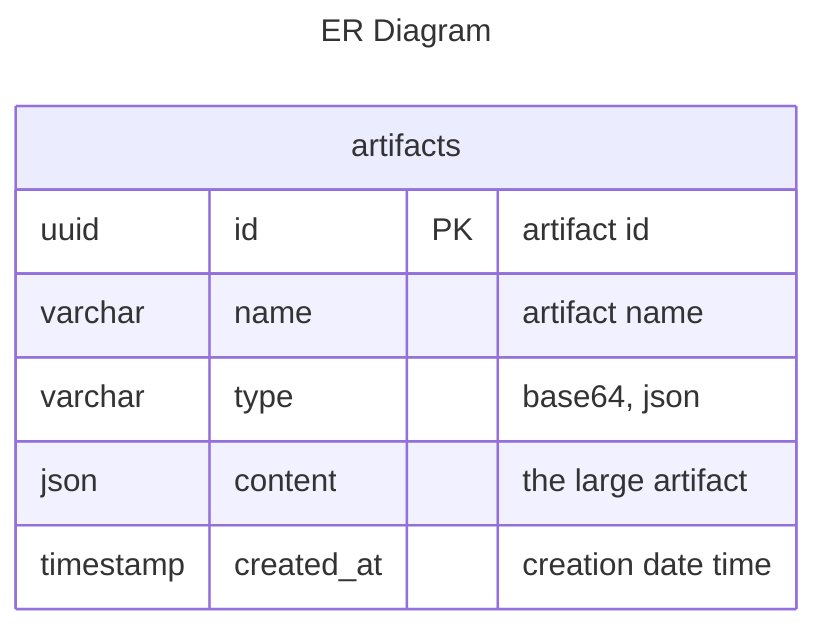
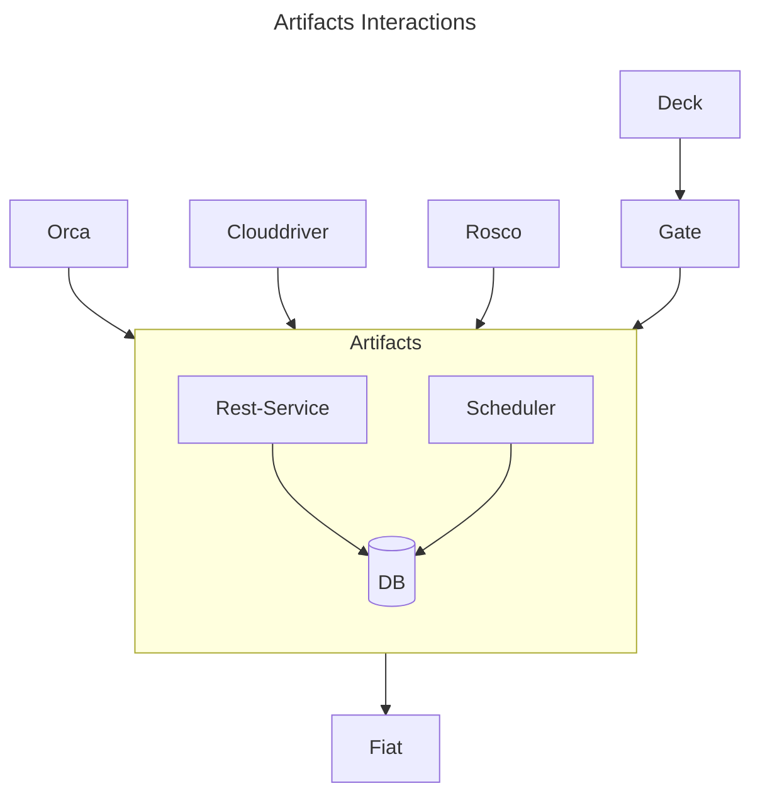
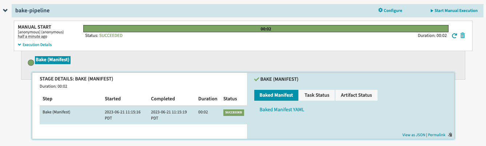
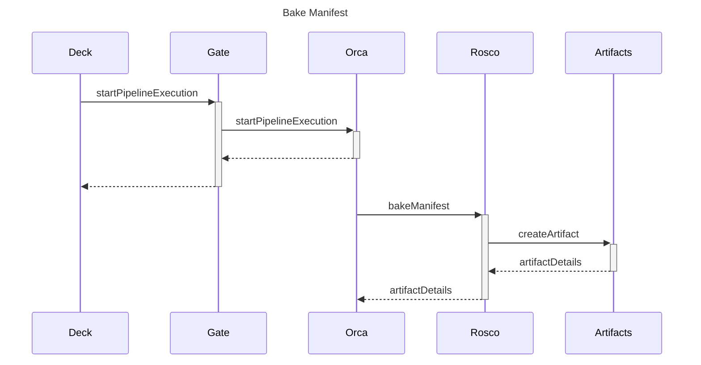
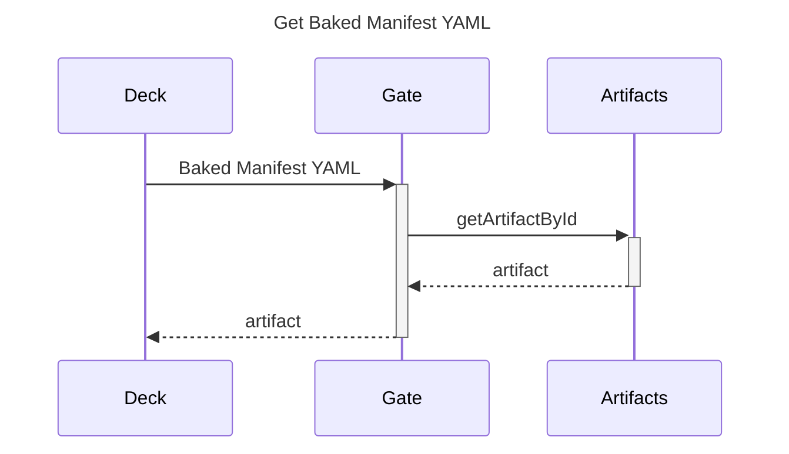

# Separate artifacts to new service

| | |
|-|-|
| **Status**     | **Proposed**, Accepted, Implemented, Obsolete |
| **RFC #**      | _Update after PR has been made_ |
| **Author(s)**  | [Nemesis Osorio](https://github.com/nemesisOsorio), [Sergio Quintero](https://github.com/sergio-quintero) |
| **SIG / WG**   | _Applicable SIG(s) or Working Group(s)_ |

## Overview

Users with large context pipelines do not have a good experience with pipeline executions. <br/>
Context and outputs in pipeline executions can contain large artifacts/objects such as k8s manifest (yaml/json files). <br/>
Spinnaker passes these artifacts/objects in request and response bodies across some services. <br/>
The idea is to create a new service to store these artifacts/objects
and only pass the `id`s of those artifacts/objects in the request/response bodies and context/outputs.

Deck users do not click to see the produced artifact/object in every single pipeline execution.
With this approach, artifacts will be loaded on demand (lazy loading).

### Goals and Non-Goals

#### Goals

* Improve Deck performance with large pipeline executions.
* Optimize message size over the wire.

#### Non-Goals

* Move [clouddriver-artifacts](https://github.com/spinnaker/clouddriver/blob/master/clouddriver-artifacts)
to the new service
* Refactor Angular code in Deck.
* Add new permissions to Fiat service.
* Avoid the duplication of artifacts when executing a pipeline multiple times without changes.

## Motivation and Rationale

* Deck is very slow and sometimes freezes when you are producing/consuming large artifacts/objects in pipeline executions.
* Smaller payloads are sent in request/response.
* Save serializing and deserializing computations.

Early customers:
* Armory on behalf of its customers.

## Timeline

The proposed plan is to implement this by pipeline stages:

* Milestone 1: (Targeting 1.32) Address stages with the most acute performance issues
  * Introduce new Artifact service
  * Bake (Manifest), both Helm and Kustomize providers
  * Deploy (Manifest)
* Milestone 2: Analyze additional stages that exhibit similar performance patterns
* Milestone 3: (Targeting 1.33) Integrate additional stages with artifact service
* Milestone 4: Support to deploy artifacts service in Operator

## Design

Creation of a new microservice for artifacts/objects. <br/>
We are proposing the following API: [Artifacts API](./artifacts-api.yml), you can render it using [Swagger Editor](https://editor-next.swagger.io/) <br/>
Support of the following artifact types:
* base64
* json (everything in the execution details has json format)



Make changes in Deck components that are using the context/output to render artifacts/objects,
and only load those artifacts/objects if you click the button/link(lazy loading).

Enable Fiat autoconfiguration and use application permissions for new artifacts endpoints.

### Retention Policy

Add a scheduler to automatically delete artifacts. The following options will be configurable:
* Retention time: How long the record will be kept in the database.
* Artifact cleanup job: Configurable cron job that deletes artifacts periodically in accordance to the retention time property.

### Dependencies

* A new database.
  * Support for MySQL and PostgreSQL.
  * Database changelogs managed by liquibase.
* Services involved
  * Orca
  * Clouddriver
  * Rosco
  * Deck
  * Gate

All changes will be implemented under a feature flag.



### Bake (Manifest) example







Diagrams: you can render them using [Mermaid Live Editor](https://mermaid.live/)
or the cli `mmdc -i README.md`

## Drawbacks

* This introduces a new service that adds complexity.
* Implementing it under a feature flag means we need to ensure it does not break existing users.

## Alternatives

An example of how it could be implemented in Orca without introducing a new service:

1. Orca will request a bake operation to Rosco.
   * Rosco performs a bake and returns the artifact in base64.
   * Orca will receive the response and store the artifact.
   * Orca will **only** add the artifactId to the pipeline context/outputs.
2. When deploying a Manifest
   * Orca will fetch the artifact by id and add the artifact to the request.
   * Clouddriver will continue to receive the manifest in the request body.

Notes:
* Only Orca would change the behavior, other services remain the same.
* Add the new table to Orca's database schema.

## Known Unknowns

* Not all the stages/services that can produce/consume those artifacts/objects are known.
* How will artifacts be passed in automated triggers? <br/>
  There seems to be no special treatment for trigger artifacts, this feature should be fine.
* How to migrate/support existing executions?

## Security, Privacy, and Compliance

* Enable Fiat autoconfiguration and use application permissions

## Operations

* The new service will require a new repository and integration to the Spinnaker CI/CD process.
* The database maintenance plan.

## Risks

A scenario when a user enables the feature flag to use the new artifacts service,
runs a pipeline with artifacts and later disables the feature, leaving orphaned artifacts.

## Future Possibilities

* Allow saving multiple artifacts at once
* Add other implementations for the persistence layer
  * s3
* Move [clouddriver-artifacts](https://github.com/spinnaker/clouddriver/blob/master/clouddriver-artifacts)
to the new artifacts service
* [Implement ACLs to artifacts](https://docs.spring.io/spring-security/reference/servlet/authorization/acls.html)
  * Add permissions to artifact accounts in configuration, example:

  ```yaml
  artifacts:
    gitrepo:
      enabled: true
      accounts:
      - name: git-repo-account
        username: my-git-user
        token: encrypted:k8s!n:my-secret!k:my-token
        permissions:
          READ:
            - foo
            - bar
          WRITE:
            - baz
  ```

  * Include the account in artifacts creation
  * for "Embedded" artifacts(dynamically generated in Spinnaker, for example using SPeL)
  we can use Application permissions
